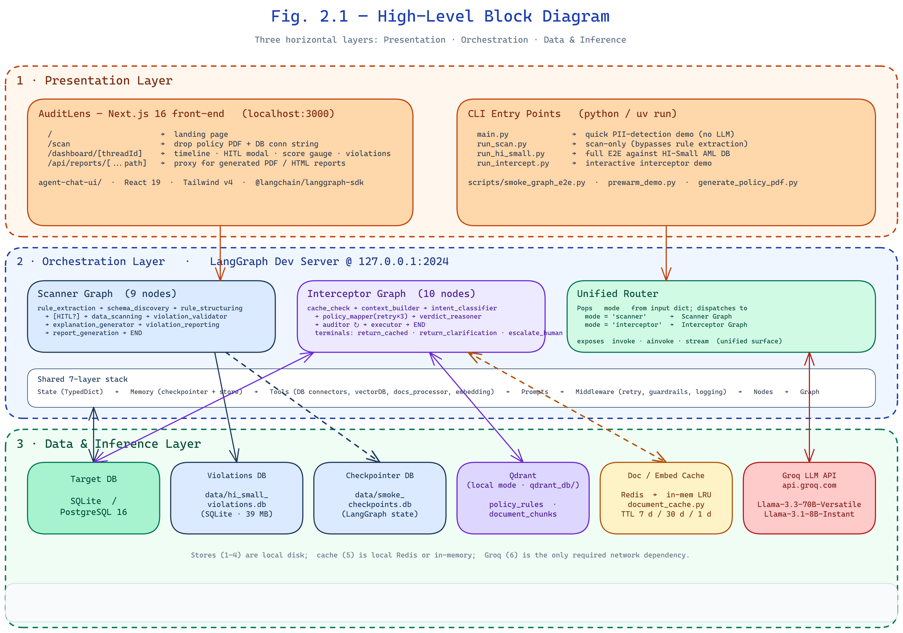
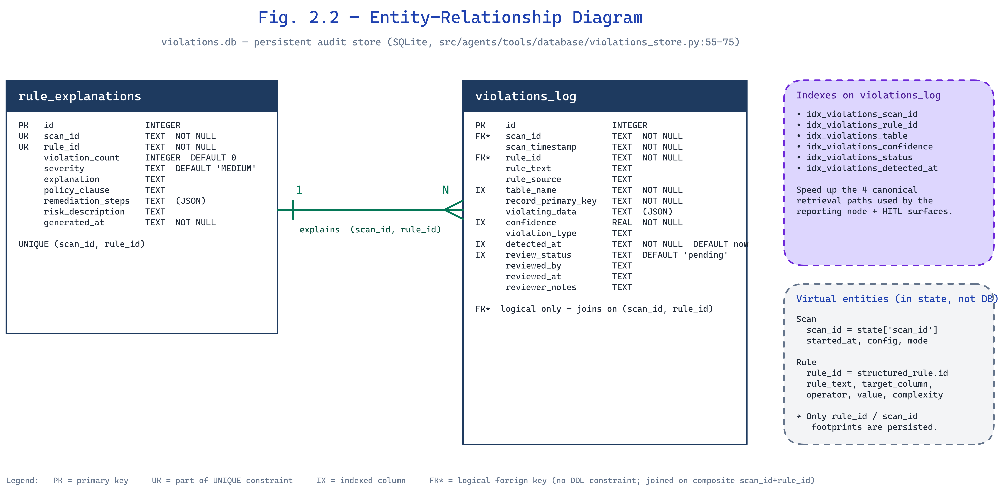
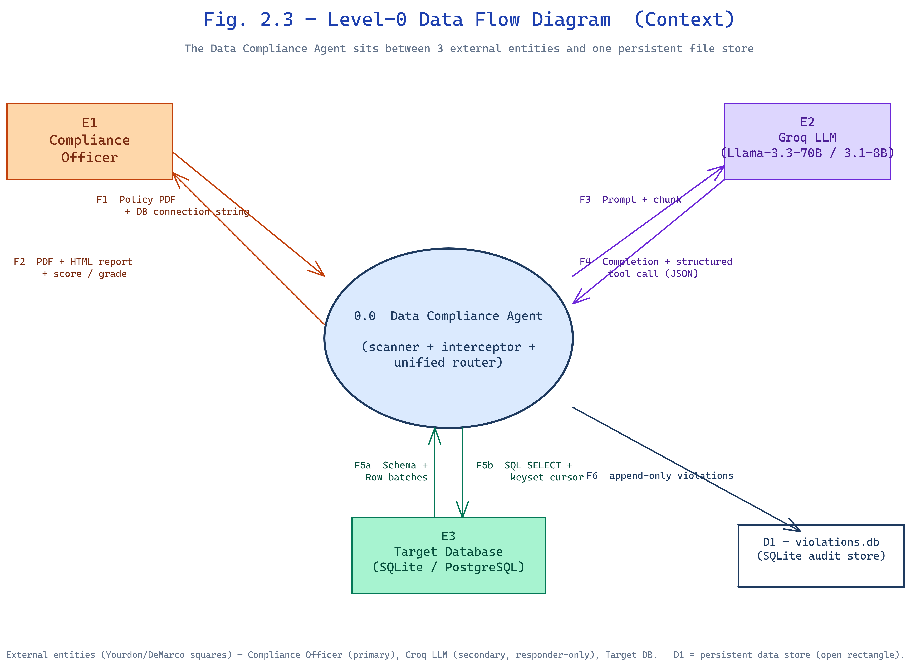
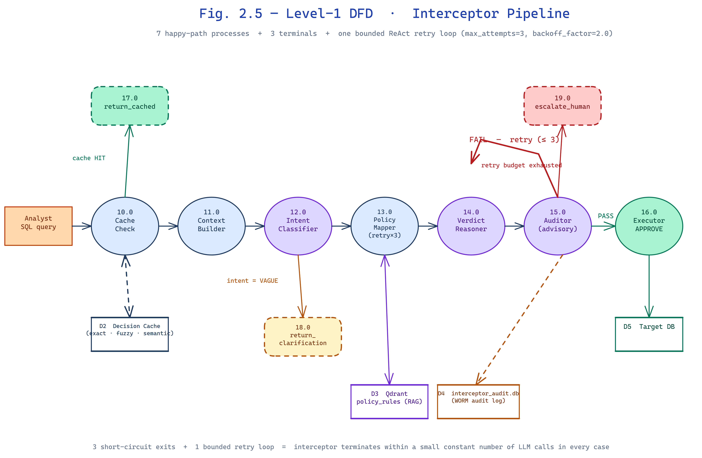
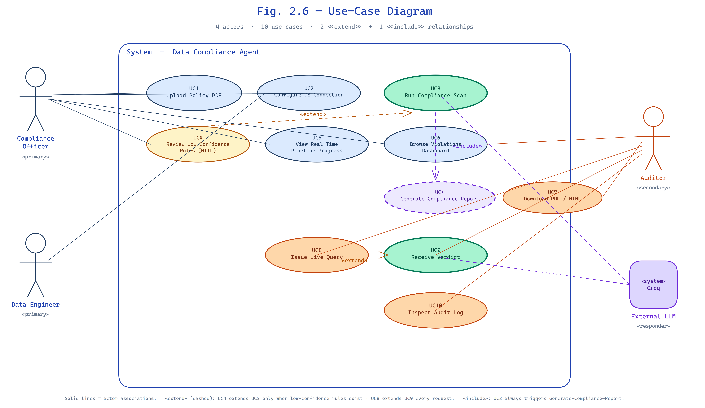
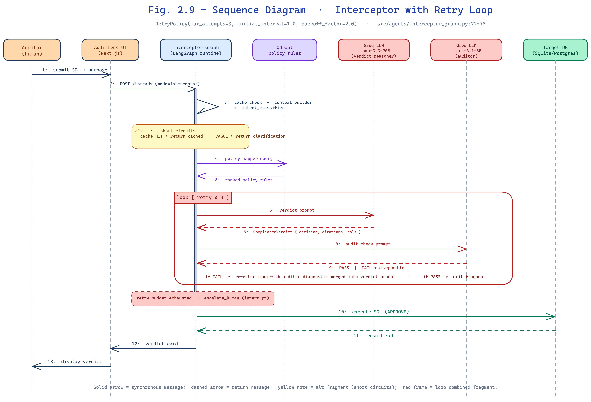

# Chapter 2 — Design

> *Chapter overview.* This chapter accompanies the project's diagrammatic design. The author has prepared the figures themselves separately; this chapter provides the explanatory prose that any reader of the figures will need in order to follow them. Six classes of diagram are described — the high-level **block diagram**, the **entity-relationship diagram (ERD)** for the violations and explanation stores, the multi-level **data-flow diagrams (DFD)**, the **use-case diagram** that captures the actors and their interactions, the **activity diagram** of the scanner happy path, and two principal **sequence diagrams** (one for the scanner, one for the interceptor with its retry loop). Where a constant or an algorithmic detail is referenced, the corresponding source-file location is given so that the reader can cross-check the design against the implementation.

---

## 2.1 Block Diagram



**Figure 2.1** is the highest-level view of the system. It depicts three horizontal layers, top to bottom: the **Presentation Layer**, the **Orchestration Layer**, and the **Data &amp; Inference Layer**.

The **Presentation Layer** consists of two surfaces. The first is the *AuditLens* Next.js front-end (`agent-chat-ui/`) that runs in the user's browser at `http://localhost:3000` during development. It exposes three pages — a landing page (`/`) describing the audit pipeline, a scanner page (`/scan`) on which the compliance officer drops a policy PDF and points the system at a target database, and a per-thread dashboard (`/dashboard/[threadId]`) that visualises the live timeline, the human-in-the-loop modal, the score gauge, and a searchable violations table. A separate static-file route at `/api/reports/[...path]` proxies the generated PDF and HTML reports back to the browser. The second surface is the command-line interface — the four entry-point scripts `main.py`, `run_scan.py`, `run_hi_small.py`, and `run_intercept.py` — which is the path used by an operator running the system from a terminal or a CI job.

The **Orchestration Layer** is the LangGraph runtime. It exposes one HTTP endpoint per compiled graph (the LangGraph Dev Server binds at `http://127.0.0.1:2024`). Within this layer live the three graphs introduced in §1.4: the scanner, the interceptor, and the unified router. They share the single shared-tooling stack (state contracts, memory, tools, prompts, middleware) and are wired into the LangGraph runtime through the corresponding `build_graph(checkpointer)` factories at `src/agents/graph.py:406-461`, `src/agents/interceptor_graph.py:46-112`, and `src/agents/unified_graph.py:52-137`.

The **Data &amp; Inference Layer** sits beneath the orchestration layer and contains five distinct stores plus the LLM endpoint:

- the **target database** — SQLite or PostgreSQL — that the scanner reads and the interceptor gates;
- the **violations database** (`data/hi_small_violations.db` in the canonical run, 39 MB after a HI-Small AML scan) which stores every detected violation in a 16-column `violations_log` table plus per-rule explanations in `rule_explanations` (`src/agents/tools/database/violations_store.py:55-75`);
- the **checkpointer database** (`data/smoke_checkpoints.db`) that persists every LangGraph state transition so that the run is resumable from any node boundary;
- the **Qdrant vector store** rooted at `<repo>/qdrant_db/`, holding two collections — `policy_rules` (384-dimensional, cosine distance) for the rule corpus, and `document_chunks` (384-dimensional, Euclidean distance) for raw policy chunks (`src/vector_database/policy_store.py:113`, `src/vector_database/qdrant_vectordb.py:64`);
- the **document/embedding cache** managed by `src/utils/document_cache.py:1-543`, with Redis as the primary store and an in-memory LRU as a fallback (TTLs of 7 days for parsed documents, 30 days for embeddings, 1 day for metadata at `document_cache.py:235-237`).

The arrows in Figure 2.1 fall into three classes. *Solid* arrows represent the synchronous request path of a single audit run (PDF upload → rules → scan → report). *Dotted* arrows represent the cache-and-memory side-channel: a cached embedding short-circuits the second LLM call, a checkpointed state allows a previously-paused run to resume, and a long-term store records human corrections for use in future scans. *Double-headed* arrows mark the small number of bidirectional channels — most notably between the `policy_mapper` interceptor node and Qdrant, where the node both *queries* the policy collection on every request and *populates* it during the initial ingestion phase that runs once per regulatory document.

This three-layer block diagram is deliberately drawn so that a reader can see, at a glance, *where any failure that the system might exhibit will originate*. A blocked Groq endpoint manifests in the inference layer; a corrupted checkpoint in the data layer; a UI freeze in the presentation layer. Section 4.6 of Chapter 4 maps each of the recently-fixed security defects (commits `0ecd609`, `a7b7792`, `8361ba0`, `7fe13ee`, `4ee19d7`, `10b7f02`) onto the block in which the defect lived, demonstrating that the three-layer separation is not merely cosmetic but operationally informative.

---

## 2.2 Entity-Relationship Diagram



**Figure 2.2** captures the persistent data model of the violations and rule-explanations stores. Although the system reads from many sources, the data it *writes* — and therefore the data that an external auditor will consume — lives in only two normalised tables, both housed in the SQLite file `violations.db`. The DDL is reproduced verbatim from `src/agents/tools/database/violations_store.py:55-75`.

### 2.2.1 Entity `violations_log`

```sql
CREATE TABLE IF NOT EXISTS violations_log (
    id                  INTEGER PRIMARY KEY AUTOINCREMENT,
    scan_id             TEXT NOT NULL,
    scan_timestamp      TEXT NOT NULL,
    rule_id             TEXT NOT NULL,
    rule_text           TEXT,
    rule_source         TEXT,
    table_name          TEXT NOT NULL,
    record_primary_key  TEXT NOT NULL,
    violating_data      TEXT,
    confidence          REAL NOT NULL,
    violation_type      TEXT,
    detected_at         TEXT NOT NULL DEFAULT (datetime('now')),
    review_status       TEXT DEFAULT 'pending',
    reviewed_by         TEXT,
    reviewed_at         TEXT,
    reviewer_notes      TEXT
);
```

This is the central fact table. One row corresponds to one *(scan, rule, target-row)* triple: it identifies which rule in which scan flagged which row of which table. The `violating_data` column is a JSON serialisation of the full offending record, captured at the moment of detection — this is what allows the report generator to render rich violation cards without re-querying the target database (and what allows the auditor to verify findings even if the target database is later modified). Six secondary indexes are created in the same module: `idx_violations_scan_id`, `idx_violations_rule_id`, `idx_violations_table`, `idx_violations_confidence`, `idx_violations_status`, `idx_violations_detected_at` (`violations_store.py:76-83`). They speed up the four canonical retrieval paths used by the violation-reporting node and the HITL surfaces.

### 2.2.2 Entity `rule_explanations`

```sql
CREATE TABLE IF NOT EXISTS rule_explanations (
    id                INTEGER PRIMARY KEY AUTOINCREMENT,
    scan_id           TEXT NOT NULL,
    rule_id           TEXT NOT NULL,
    violation_count   INTEGER DEFAULT 0,
    severity          TEXT DEFAULT 'MEDIUM',
    explanation       TEXT,
    policy_clause     TEXT,
    remediation_steps TEXT,
    risk_description  TEXT,
    generated_at      TEXT NOT NULL,
    UNIQUE(scan_id, rule_id)
);
```

This is a thin lookup table keyed on `(scan_id, rule_id)`. Each row carries the LLM-generated narrative explaining what the rule means, the clause of the regulatory document from which it was derived, the human-readable risk description, and an ordered list of remediation steps stored as JSON. The `UNIQUE(scan_id, rule_id)` constraint is what allows the upsert pattern at `violations_store.py:214-256` to rewrite an explanation for the same rule in the same scan without inserting duplicates.

### 2.2.3 Cardinality and Relationships

The relationship between the two tables is **one-to-many**: one row in `rule_explanations` corresponds to *N* rows in `violations_log` for the same `(scan_id, rule_id)` pair, where *N* is recorded as `violation_count` in the explanation row. There is no formal foreign-key constraint between the two — both tables refer to a logical *scan run* whose identifier is generated at the start of the run and propagated through state — but the data model is normalised in the third-normal-form sense: every non-key attribute of `rule_explanations` depends only on the `(scan_id, rule_id)` composite key.

The conceptual model also contains two **virtual entities** that do not have their own tables but are nevertheless first-class in the system: `Rule` (the structured rule object that the scanner mapped onto database columns) and `Scan` (the audit run itself). Both are reified inside the LangGraph state object — a `Rule` lives in `state["structured_rules"]` and a `Scan` is identified by `state["scan_id"]` — and only their *footprints* are persisted to disk, namely by the rule and scan identifiers stored as `TEXT` columns in the two tables above. Keeping these entities in state rather than in a third table is a deliberate normalisation decision: it means a scan run is fully described by the union of its checkpoint (a recoverable state snapshot) and the violations and explanations rows it produces, with no chance of orphan rows or schema drift between LangGraph state and a parallel rule-table.

---

## 2.3 Data Flow Diagrams

The DFDs are presented at two levels of detail: a Level-0 *context diagram* (Figure 2.3) and two Level-1 *decompositions* — one for the scanner pipeline (Figure 2.4) and one for the interceptor pipeline (Figure 2.5).

### 2.3.1 Level-0 Context



The Level-0 diagram treats the entire **Data Compliance Agent** as a single circular process, sitting between three external entities: the **Compliance Officer** (the human user), the **Target Database** (the system being audited), and the **Groq LLM endpoint** (the inference provider). Five data flows cross the system boundary.

- *Policy PDF* and *DB connection string* flow inward from the Compliance Officer to the system.
- *Schema* and *Row batches* flow inward from the Target Database in response to JDBC-style read queries.
- *Prompt + chunk* flows outward to the Groq endpoint, and *Completion + structured tool call* flows back inward.
- *PDF report*, *HTML report* and an inline *score &amp; grade* flow outward to the Compliance Officer.
- A separate *Violations DB* output is written to the local filesystem and is the artefact preserved for audit.

This level is sufficient to communicate the system to a non-technical stakeholder — for example, a department head approving the project — but it deliberately hides the multi-graph architecture inside.

### 2.3.2 Level-1 Decomposition — Scanner Pipeline

Inside the scanner process, Figure 2.4 expands the single circle into the nine numbered processes that correspond exactly to the nine LangGraph nodes named in §1.4. Each process is a numbered bubble (1.0 through 9.0) and the data stores are drawn as open-ended rectangles.

- **1.0 Rule Extraction** reads the `Policy PDF` (data store *D1*), splits it into ~1500-character chunks, sends each chunk to the LLM with the prompt at `src/agents/prompts/rule_extraction.py`, and writes the resulting list of `ComplianceRuleModel` objects into the in-memory LangGraph state (data store *D2*).
- **2.0 Schema Discovery** reads from the Target Database (*D3*) and writes a `schema_metadata` dictionary into *D2*.
- **3.0 Rule Structuring** reads `raw_rules` and `schema_metadata` from *D2* and writes back `structured_rules` (confidence ≥ 0.7) and `low_confidence_rules` (the rest).
- **3.5 Human Review** is conditional. When `low_confidence_rules` is non-empty it is invoked; it reads from *D2*, writes a HITL prompt to the front-end UI (*D4*), waits for the operator's `{approved, edited, dropped}` payload, and merges the approved rules back into *D2*.
- **4.0 Data Scanning** reads `structured_rules`, `schema_metadata`, and the Target Database (*D3*) and writes detected violations into the external **Violations DB** (*D5*) — the SQLite store described in §2.2 above. Crucially, it does *not* write the full violation set into *D2*: only an aggregated `scan_summary` is returned to LangGraph state, which keeps each checkpoint small.
- **5.0 Violation Validation** reads a sample of low-confidence rows from *D5*, sends each to the LLM for true-positive classification, and writes `validation_summary` back into *D2*.
- **6.0 Explanation Generation** reads `structured_rules` and `scan_summary` from *D2*, calls the LLM once per rule for narrative explanation and remediation, and stores results in the `rule_explanations` table in *D5*.
- **7.0 Violation Reporting** reads from *D5* and *D2*, computes the compliance score, grade, and per-rule rollups, and writes the resulting `violation_report` into *D2*.
- **8.0 Report Generation** reads `violation_report` and `rule_explanations` from *D2* and *D5* and writes the PDF and HTML report files into *D6* (the `data/` filesystem directory). The two file paths are echoed back into *D2* under the `report_paths` key, completing the run.

### 2.3.3 Level-1 Decomposition — Interceptor Pipeline



The interceptor's DFD (Figure 2.5) is shorter but more cyclic. The seven happy-path processes are: 10.0 Cache Check, 11.0 Context Builder, 12.0 Intent Classifier, 13.0 Policy Mapper, 14.0 Verdict Reasoner, 15.0 Auditor, 16.0 Executor. Three terminal processes — 17.0 Return Cached, 18.0 Return Clarification, 19.0 Escalate Human — replace process 16.0 when the previous step demands it. The cycle is the auditor's loop back to the verdict reasoner: when the audit fails and the retry budget is not exhausted, control returns to process 14.0 with the audit's diagnostic feedback merged into the prompt. The data stores accessed are the **Decision Cache** (a 3-layer in-memory store), the **Qdrant Policy Collection**, the **Audit Log SQLite store** (`data/interceptor_audit.db`, 52 KB after the smoke runs), and the same Target Database accessed by the executor.

The Level-1 diagrams are explicitly *isomorphic* to the implementation: each numbered process corresponds to a single Python module under `src/agents/nodes/` or `src/agents/interceptor_nodes/`. This isomorphism is what lets the Testing chapter (Chapter 4) write one unit-test file per process and claim end-to-end DFD coverage.

---

## 2.4 Use Case Diagram



**Figure 2.6** captures four primary actors and ten use cases arranged around a single system boundary. The actors are:

- **Compliance Officer** (primary, human) — uploads policies, reviews low-confidence rules, downloads reports.
- **Data Engineer** (primary, human) — configures database connections, manages connection-string secrets in `.env`, monitors the local Qdrant store and the violations database.
- **Auditor** (secondary, human) — consumes the generated PDF and the violations SQLite file as evidence, may issue ad-hoc SQL queries through the interceptor mode.
- **External LLM (Groq)** (secondary, system) — fulfils every prompt-completion pair issued by the rule-extraction, validation, explanation, intent-classifier, verdict, and audit nodes.

Ten use cases sit inside the system boundary:

1. **Upload Policy PDF** — Compliance Officer.
2. **Configure Database Connection** — Data Engineer.
3. **Run Compliance Scan** — Compliance Officer (initiated via UI or CLI).
4. **Review Low-Confidence Rules** — Compliance Officer (the HITL surface; *includes* "Approve / Edit / Drop Rule" sub-cases).
5. **View Real-Time Pipeline Progress** — Compliance Officer (via the AuditLens timeline component).
6. **Browse Violations Dashboard** — Compliance Officer or Auditor.
7. **Download PDF / HTML Report** — Auditor.
8. **Issue Live Query** — Auditor (the interceptor entry point); *extends* Use Case 9.
9. **Receive Verdict (Approve / Block / Clarify)** — Auditor.
10. **Inspect Audit Log** — Auditor (via direct read of the WORM `interceptor_audit.db`).

The diagram includes two `<<extend>>` relationships: Use Case 4 extends Use Case 3 only when the conditional routing function `_route_after_structuring` returns `human_review`, and Use Case 8 extends Use Case 9 every time a query is issued. One `<<include>>` relationship binds Use Case 3 to *Generate Compliance Report* (an internal use case that fires unconditionally at the end of every scan).

The External LLM actor is shown on the system boundary because it is part of every use case that involves natural-language understanding, but it never initiates an interaction — it is purely *responder*.

---

## 2.5 Activity Diagram

**Figure 2.7** is an activity diagram of the scanner's happy path. It mirrors the Level-1 DFD but emphasises *control flow* rather than *data flow*: the diagram contains the standard solid black initial node, the rounded-corner activity boxes, the diamond decision node at *Are there low-confidence rules?*, the join bar, and the bullseye final node.

The control flow is linear from the initial node up to *3.0 Rule Structuring*. After that activity, the decision diamond inspects the value of `state["low_confidence_rules"]` (the same key that `_route_after_structuring` at `src/agents/graph.py:396-401` reads). On the *yes* branch, control passes to *3.5 Human Review*, which suspends the graph through LangGraph's `interrupt()` and waits for the operator's resume payload `{approved, edited, dropped}`. On the *no* branch, control jumps directly to *4.0 Data Scanning*. Both branches re-converge at the join bar and continue linearly through the validation, explanation, reporting, and report-generation activities, terminating at the bullseye final node when `state["report_paths"]` has been populated with a `.pdf` and `.html` filename.

A second diamond is drawn inside *3.5 Human Review* to show the three-way operator decision: an *approve* edge merges the rule into `structured_rules`, an *edit* edge modifies the rule's `target_column` or `value` field before the merge, and a *drop* edge discards the rule entirely. The operator's choice for each individual rule is recorded so that the long-term store at `src/agents/memory/store.py:39-127` can learn from corrections in subsequent scans.

The diagram also shows two side-effect arrows. The first records a write to the *Violations DB* whenever activity *4.0 Data Scanning* finds a violating row; the second records a write to the *Audit Log* whenever any LLM call is made. These side effects are intentional: they decouple the persistent compliance record from the in-memory LangGraph state, so that even if a checkpoint is corrupted the violations and the audit trail survive.

---

## 2.6 Sequence Diagrams

Two sequence diagrams accompany the report. The first shows the scanner end-to-end; the second shows the interceptor with its retry loop, which is the most subtle control-flow construct in the project.

### 2.6.1 Scanner — End-to-End Sequence (Figure 2.8)

The diagram shows seven lifelines arranged left to right: **Compliance Officer**, **AuditLens UI** (the Next.js front-end), **LangGraph Runtime**, **Scanner Graph**, **Groq LLM**, **Target SQLite Database**, and **Violations SQLite Database**. The sequence begins with the officer dropping a PDF onto the AuditLens UI, which opens a `POST /threads` request to the LangGraph runtime carrying the policy path, the database connection string, and the desired batch size. The runtime instantiates a thread, instantiates the scanner graph by calling `build_graph(checkpointer)`, and begins streaming `updates` events back to the UI.

The graph then issues a series of strictly-ordered messages:

1. The `rule_extraction` node sends *N* prompt-completion pairs to the Groq LLM (one per chunk of the policy PDF), each tagged with the chunk index, and receives a list of `ComplianceRuleModel` objects in return.
2. The `schema_discovery` node opens a SQLAlchemy session against the Target SQLite Database and issues `PRAGMA table_info(...)` and `SELECT COUNT(*)` for each table. It returns a `schema_metadata` dictionary.
3. The `rule_structuring` node performs no I/O — it computes the `target_column` mapping, the operator-alias normalisation, and the confidence score in pure Python.
4. If any rule has confidence below 0.7, the graph emits an `__interrupt__` event over the WebSocket. The UI displays the HITL modal; the officer's `{approved, edited, dropped}` payload is sent back as a `Command(resume=...)`.
5. The `data_scanning` node executes a sequence of keyset-paginated `SELECT` queries against the Target SQLite Database. For each violating row it issues an `INSERT` against the Violations Database. The `scan_summary` (counts, no row data) is returned.
6. The `violation_validator` node samples up to 20 low-confidence violations per rule and sends them as a single batch prompt to Groq; the response is a list of `{confirmed, false_positive}` labels which are written back to `violations_log.review_status`.
7. The `explanation_generator` node sends one prompt per rule to Groq using the Llama-3.3-70B model; each completion is upserted into `rule_explanations`.
8. The `violation_reporting` node aggregates from `violations_log` and `rule_explanations` to build the `violation_report` structure.
9. The `report_generation` node passes `violation_report` and `rule_explanations` to `src/stages/report_generator.py:680-705`, which writes both a PDF (via ReportLab) and an HTML file to disk.
10. The runtime sends a final `END` event over the WebSocket; the UI displays the score and provides the download buttons.

The diagram uses self-arrows on the Scanner Graph lifeline to show the internal node-to-node transitions and uses dashed return arrows to indicate the streaming `updates` events that the UI receives between every node boundary.

### 2.6.2 Interceptor — Sequence with Retry Loop (Figure 2.9)



The interceptor's sequence diagram is shorter but contains a *combined fragment* of type `loop [retry_budget]` enclosing the verdict-reasoner and auditor lifelines. This fragment is the visual representation of the retry policy declared at `src/agents/interceptor_graph.py:72-76`:

```python
RetryPolicy(max_attempts=3, initial_interval=1.0, backoff_factor=2.0)
```

The diagram begins with the **Auditor** (human) issuing a SQL query to the **AuditLens UI**, which forwards it to the **Interceptor Graph** with a `mode=interceptor` flag. The graph then progresses sequentially through `cache_check`, `context_builder`, and `intent_classifier`. If the intent classifier returns `CLEAR`, the graph proceeds to `policy_mapper`, which queries the **Qdrant Policy Collection** and returns a ranked list of relevant rules. The `verdict_reasoner` node sends a structured prompt to Groq (Llama-3.3-70B) and receives a `ComplianceVerdict` object containing `decision ∈ {APPROVE, BLOCK}`, a list of cited policies, and a list of sensitive columns touched.

The combined fragment then encloses the `auditor` step. The auditor sends a check-prompt to Groq (Llama-3.1-8B) asking whether the verdict is internally consistent — its citations grounded, its column references valid, its decision logically derivable from the cited policies. A `PASS` exits the fragment and dispatches to `executor`; a `FAIL` returns control to `verdict_reasoner` with the auditor's diagnostic feedback merged into the prompt, decrementing the retry budget. The fragment is therefore a small, bounded ReAct-style [5] loop. If the budget is exhausted, control passes to the `escalate_human` terminal node, which itself raises a LangGraph `interrupt()` and surfaces the case in the AuditLens *Pending Review* queue.

A second decision in the diagram appears at the cache-check step: a cache hit on any of the three layers (exact, fuzzy, semantic) short-circuits the entire pipeline and dispatches directly to `return_cached`. The cache layers are described in §3.8 and have TTLs of 1 hour for the exact and fuzzy layers and 6 hours for the semantic layer.

A third short-circuit appears at the intent-classifier step: when the intent is judged `VAGUE` (e.g. `SELECT * FROM customers` with no `stated_purpose`), the diagram dispatches directly to `return_clarification`, which returns to the UI with a structured request for more context rather than guessing an intent.

These three short-circuits — cached, clarification, escalation — together with the central retry loop, are the four exit points that make the interceptor a **bounded** decision system: it terminates within a small constant number of LLM calls in every case, and it does so without ever returning a verdict that has not been audited.

---

> *Chapter summary.* Six classes of design diagram have been described in detail. The block diagram lays out the three-layer architecture; the ERD documents the only two persisted tables (`violations_log` and `rule_explanations`); the multi-level DFDs map the system's processes one-to-one onto its LangGraph nodes; the use-case diagram identifies four actors and ten use cases; the activity diagram traces the scanner's happy path with the human-review branch; and the two sequence diagrams expose the end-to-end scanner choreography and the interceptor's audit-bounded retry loop. With the design now fully described, Chapter 3 turns to the implementation, presenting the project layout, the state contracts, the three graphs, and the algorithmic core in code-level detail.
